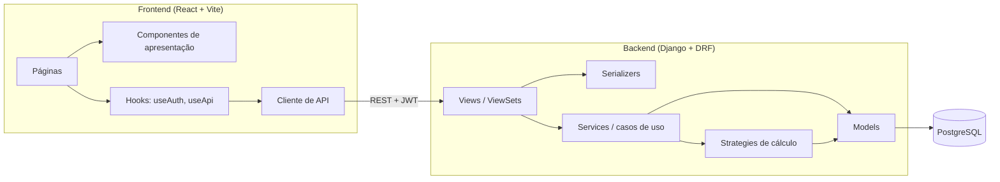

# Arquitetura e Padrões de Projeto — Grana.io

Este documento define a arquitetura de referência e os padrões de projeto adotados no Grana.io.
Ele complementa a [constituição](../.specify/memory/constitution.md): a constituição diz **o que
é obrigatório** (princípios), este documento diz **como estruturar o código** para cumpri-los.

- Todo `plan.md` MUST seguir este documento. Desvios só são aceitos se registrados na seção
  "Complexity Tracking" do plano, com justificativa.
- Este documento pode evoluir sem emenda à constituição. Mudanças devem ser feitas em commit
  próprio (`docs: …`) e, se afetarem código já existente, vir acompanhadas de plano de migração.
- Regra geral (Princípio VI — YAGNI): um padrão só entra quando um item do backlog precisa dele.
  A coluna "Onde entra" de cada tabela aponta o item que justifica o padrão.

---

## 1. Visão geral



Tudo roda localmente via Docker Compose (containers `db`, `backend` e `frontend`).

---

## 2. Backend (Django + DRF)

### 2.1 Arquitetura em camadas

| Camada | Responsabilidade | Não pode |
|---|---|---|
| **Models** | Estrutura dos dados, constraints e validações de integridade simples. | Conter regra de negócio que envolva mais de um model. |
| **Serializers** | Validar a entrada e formatar a saída (fazem o papel de DTO da API). | Fazer cálculo financeiro ou orquestrar casos de uso. |
| **Views / ViewSets** | Autenticação, permissão, chamar o serializer/service e devolver a resposta HTTP. | Conter regra de negócio (views "finas"). |
| **Services** | Regras de negócio, cálculos e casos de uso com vários passos. | Depender de `request` ou de objetos HTTP. |

Fluxo típico: `View → Serializer (valida) → Service (executa) → Serializer (formata) → Response`.

### 2.2 Padrões adotados

| Padrão | Onde entra | Como aplicar |
|---|---|---|
| **Service Layer** | Todo cálculo e regra de negócio (Princípio III). | Classes/funções em `<app>/services/`. Recebem e devolvem objetos Python (models, dataclasses), nunca `request`/`Response`. Testáveis sem HTTP. |
| **Application Service (caso de uso)** | Operações com vários passos: criar mês com recorrentes e cópia do anterior (US-07b, US-09) e parcelamento (US-10). | Um service por caso de uso (ex.: `CriarMesService`), com um método público de entrada, executado dentro de `transaction.atomic()`. |
| **Strategy** | Cálculo do líquido por tipo de cenário: líquido direto, CLT e PJ (US-12, US-13, US-13b). | Uma interface comum (ex.: `calcular(cenario, competencia) -> DetalhamentoSalario`) e uma classe por tipo. Quem consome (saldo, comparação, projeção) nunca verifica o tipo do cenário. |
| **Factory simples (registry)** | Escolher a strategy pelo tipo do cenário. | Um dicionário `{tipo: StrategyClass}` e uma função `obter_strategy(tipo)`. Tipo desconhecido gera erro explícito. Proibido espalhar `if/elif` por tipo de cenário. |
| **Value Object / DTO imutável** | Resultados de cálculo (ex.: `DetalhamentoSalario`, `ResultadoSaldo`) e valores monetários. | `@dataclass(frozen=True)`. Valores monetários passam por um helper único em `core` (ex.: `Dinheiro`/`arredondar()`) que aplica `Decimal` + ROUND_HALF_UP com 2 casas (Princípio III). |
| **Table-driven (regras como dados)** | Faixas de INSS e IRRF por ano de vigência (US-15). | As faixas ficam no banco, e uma única função calcula tabelas progressivas, reaproveitada pelos dois impostos. O ano usado é o da competência. |
| **Abstract Base Model + Mixin** | Isolamento por usuário (US-03, Princípio II). | Todo model de domínio herda de `core.models.OwnedModel`. Toda viewset de domínio usa o mixin de queryset por dono (filtra por `request.user` e define o dono no `perform_create`). |

### 2.3 Estrutura de pastas (indicativa)

Os nomes finais dos apps são definidos no `plan.md` de cada spec; a organização interna segue este
modelo:

```text
backend/
├── config/                 # settings, urls, wsgi
├── core/                   # OwnedModel, mixins, helper monetário, utilidades comuns
├── accounts/               # usuário e autenticação
├── <app>/                  # ex.: gastos, cenarios, relatorios
│   ├── models.py
│   ├── serializers.py
│   ├── views.py
│   ├── urls.py
│   ├── services/           # regras de negócio e casos de uso
│   └── strategies/         # somente em apps com variação de algoritmo (ex.: cenarios)
└── tests/
    └── <app>/              # espelha a estrutura dos apps
```

### 2.4 Quando criar o quê

- **Regra envolve só um campo ou um model** → validação no serializer ou no model.
- **Regra envolve cálculo ou mais de um model** → service.
- **Operação tem vários passos que precisam ser atômicos** → application service com `transaction.atomic()`.
- **Existem 2+ algoritmos intercambiáveis para a mesma pergunta** → strategy + registry.
- **Resultado de cálculo trafega entre camadas** → dataclass imutável, não `dict` solto.

---

## 3. Frontend (React + Vite)

| Padrão | Onde entra | Como aplicar |
|---|---|---|
| **Provider (Context API)** | Sessão do usuário (US-02, US-26). | `AuthProvider` guarda o usuário e os tokens. Sem Redux: o estado global é pequeno. |
| **Custom Hooks** | Lógica reaproveitável. | `useAuth()`, `useApi()` e hooks por recurso (ex.: `useGastos()`). Os componentes não chamam `fetch` diretamente. |
| **Cliente de API centralizado (Adapter)** | Toda comunicação com o backend (Princípio V). | Módulo único em `src/api/`: URL base vinda de `VITE_API_URL`, cabeçalho de autenticação, refresh automático do token e tradução dos erros da API para mensagens exibíveis. |
| **Rota protegida (Route Guard)** | Páginas que exigem login (US-02). | Componente `<RotaProtegida>` que redireciona para `/login` sem sessão válida. |
| **Páginas × componentes de apresentação** | Todas as telas. | Páginas buscam dados (via hooks) e montam a tela; componentes recebem props e só exibem. |

Regra do Princípio V: o frontend **não calcula valores financeiros**. Ele formata (R$, datas)
e exibe o que a API retorna.

Estrutura indicativa:

```text
frontend/src/
├── api/          # cliente HTTP e funções por recurso
├── auth/         # AuthProvider, RotaProtegida
├── hooks/        # hooks reaproveitáveis
├── components/   # componentes de apresentação
├── pages/        # telas (uma pasta por página)
└── utils/        # formatação pt-BR (moeda, data)
```

---

## 4. Transversais

| Padrão | Aplicação |
|---|---|
| **12-Factor Config** | Toda configuração vem de variáveis de ambiente (`.env` fora do Git, `.env.example` versionado). Preparação para o RNF-08. |
| **REST orientado a recursos** | Endpoints no plural sob `/api/`, verbos HTTP padrão, contratos documentados em `specs/<feature>/contracts/`. |
| **Erros padronizados** | Erros de validação no formato padrão do DRF (`{"campo": ["mensagem"]}`), com mensagens em pt-BR que digam como corrigir. |
| **Testes: Arrange-Act-Assert + fixtures** | Fixtures do pytest para usuários e clientes autenticados. Casos fiscais parametrizados (`@pytest.mark.parametrize`) com os valores conferidos manualmente citados no teste. |

---

## 5. Padrões deliberadamente NÃO adotados

| Padrão | Motivo |
|---|---|
| **Repository** | O ORM do Django já faz esse papel; uma camada extra só duplicaria código. |
| **Observer via Django signals** | Efeitos implícitos dificultam entender o fluxo. Preferir chamada explícita no service (ex.: criar categorias padrão no cadastro). Só usar signal com justificativa no `plan.md`. |
| **CQRS / Event Sourcing** | Nenhum requisito de auditoria ou escala que justifique. |
| **Microserviços** | Projeto de uma pessoa, rodando local: um monólito modular é suficiente. |
| **Redux / gerenciador de estado global** | O estado global se resume à sessão; Context + hooks bastam. |
| **Container de injeção de dependência** | Parâmetros de construtor e o registry de strategies cobrem as necessidades de teste. |

Se uma spec futura precisar de um desses, ele entra pela seção "Complexity Tracking" do
`plan.md`, e este documento é atualizado.
